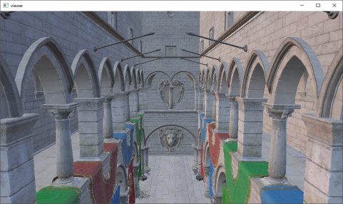

# glTF Viewer

An application for demonstrating the practical usage of [fx-gltf](https://github.com/jessey-git/fx-gltf) within the context of a modern rendering project.

## Features
* Lightly abstracted DirectX 12 rendering
    * Enough abstraction to get out of the way, but not too much so-as to interfere with learning
* Auto mesh coloring for easy debugging/experimentation
* PBR materials with image-based lighting (IBL)




## Usage
```
A simple glTF2.0 scene viewer using DirectX 12
Usage: viewer.exe [OPTIONS] file

Positionals:
  file TEXT (REQUIRED)   Scene to load (.gltf or .glb)

Options:
  -h,--help              Print this help message and exit
  --width INT            Initial window width
  --height INT           Initial window height
  -r,--rotate            Auto rotate model
  -m,--materials         Enable model materials
  -i,--ibl               Enable IBL
  -g,--ground            Enable ground plane
  -x FLOAT               Camera x position
  -y FLOAT               Camera y position
  -z FLOAT               Camera z position

Controls:
  Orbit with left mouse button
  Dolly with middle mouse button
```

## Design

### Code

#### ```MeshData.h```
* Processes a given ```fx::gltf::Mesh```/```fx::gltf::Mesh::Primitive``` pair using its ```fx::gltf::Buffer``` and ```fx::gltf::Accessor``` information and exposes it in a more graphics-api friendly manner

#### ```ImageData.h```
* Processes a given ```fx::gltf::Image``` and fills in the appropriate set of information for actual loading
* The difference between external, embedded, and binary glTF formats are handled here

#### ```DirectX/D3DMeshData.cpp```
* Uses ```MeshData``` to build the actual vertex/normal/index etc. buffers for DirectX 12
* Performs the mesh's command list drawing during scene render

#### ```DirectX/D3DTextureSet.cpp```
* Uses ```ImageData``` to load in the actual image textures with the WIC API

#### ```DirectX/D3DGraph.h```
* Uses ```fx::gltf::Document``` and ```fx::gltf::Node``` to visit each node in the scene-graph
* Applies the node's transformation data so we can use it during update/render

#### ```DirectX/D3DEngine.cpp```
* Builds all DirectX 12 resources necessary for rendering
* Uses ```D3DGraph``` to build/traverse the scene-graph, building up ```D3DMeshInstance```s along the way
* Coordinates the update/render sequencing flow

### Psuedo call-graph
* Win32Application::Run
* D3DEngine / Engine
    * Initialization
        * Load and process the glTF document
            * Textures and materials
            * Mesh pieces
            * Scene-graph
        * Compile necessary shaders to support the loaded materials
        * Establish all DirectX resources (Heaps, PSO's, constant buffers, etc.)
    * Update/Render loop
        * Set Root Signature, PSO's, constant buffers, structured buffers, etc. 
        * Draw each mesh instance
            * Set mesh constant buffers
            * Set mesh vertex/normal/index buffers
            * Perform actual draw call

### DirectX 12 / glTF Integration Notes

#### PipelineStateObject Input Layout
Most glTF files today store vertex/normal/tex-coord buffers separately from each other (non interleaved). For example, consider a simple 6 vertex mesh with vertex/normal/tex-coord formats of Vec3/Vec3/Vec2 respectively:

```[vvvvvv][nnnnnn][tttttt] == 3 buffers: [72 bytes][72 bytes][48 bytes]```

Compare this against an interleaved layout which looks as follows:

```[vntvntvntvntvntvnt] == 1 buffer: [192 bytes]```

This matters when creating the PipelineStateObject's InputLayout.  To properly use glTF data in this format without extra data manipulation, make use of the ```D3D12_INPUT_ELEMENT_DESC.InputSlot``` field.  See ```D3DEngine::BuildPipelineStateObjects``` for reference.

## Known Issues and TODOs
* General
    * Interleaved buffers from glTF are not supported currently
    * Scene centering does not seem to be working for all tested models. Some scenes still seem shifted away from 0,0,0

* DirectX 12
    * Minor: Mip-maps are not generated for the textures
    * Advanced: A memory-manager with pooling / page management should be implemented
    * Advanced: A new set of abstractions for properly batching ResourceBarriers is needed (likely requires refactoring away DeviceResources + FrameResources into finer grained objects)

* Vulkan
    * Needs implementing (patches welcome)

## Supported Compilers
* Microsoft Visual C++ 2017 15.6+ (and possibly earlier)

## License


Licensed under the MIT License <http://opensource.org/licenses/MIT>.

Copyright (c) 2018-2021 Jesse Yurkovich

Permission is hereby  granted, free of charge, to any  person obtaining a copy
of this software and associated  documentation files (the "Software"), to deal
in the Software  without restriction, including without  limitation the rights
to  use, copy,  modify, merge,  publish, distribute,  sublicense, and/or  sell
copies  of  the Software,  and  to  permit persons  to  whom  the Software  is
furnished to do so, subject to the following conditions:

The above copyright notice and this permission notice shall be included in all
copies or substantial portions of the Software.

THE SOFTWARE  IS PROVIDED "AS  IS", WITHOUT WARRANTY  OF ANY KIND,  EXPRESS OR
IMPLIED,  INCLUDING BUT  NOT  LIMITED TO  THE  WARRANTIES OF  MERCHANTABILITY,
FITNESS FOR  A PARTICULAR PURPOSE AND  NONINFRINGEMENT. IN NO EVENT  SHALL THE
AUTHORS  OR COPYRIGHT  HOLDERS  BE  LIABLE FOR  ANY  CLAIM,  DAMAGES OR  OTHER
LIABILITY, WHETHER IN AN ACTION OF  CONTRACT, TORT OR OTHERWISE, ARISING FROM,
OUT OF OR IN CONNECTION WITH THE SOFTWARE  OR THE USE OR OTHER DEALINGS IN THE
SOFTWARE.

## Used third-party tools

This software would not be possible without the help of the following resources.

* [d3dx12.h](https://github.com/Microsoft/DirectX-Graphics-Samples/tree/master/Libraries/D3DX12) containing helper structures and functions for D3D12
* [DirectX-Graphics-Samples](https://github.com/Microsoft/DirectX-Graphics-Samples) for usage examples and API inspiration
* [Xbox-ATG-Samples](https://github.com/Microsoft/Xbox-ATG-Samples) for usage examples and API inspiration
* [CLI11](https://github.com/CLIUtils/CLI11) for command-line parsing
