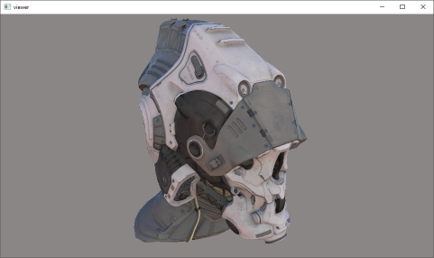
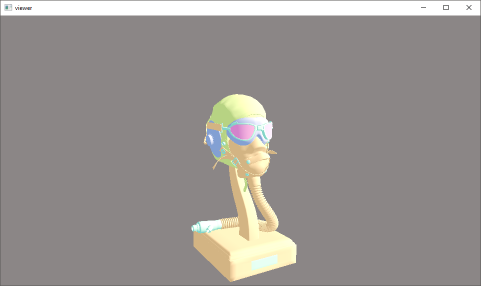

# glTF Viewer

An application for demonstrating the practical usage of [fx-gltf](https://github.com/jessey-git/fx-gltf) within the context of modern rendering APIs.

## Features
* DirectX 12






## Usage
```viewer.exe [--width: width] [--height: height] model```

## Design

### Code

#### ```MeshData.h```
* Processes a given ```fx::gltf::Mesh```/```fx::gltf::Mesh::Primitive``` pair using its ```fx::gltf::Buffer``` and ```fx::gltf::Accessor``` information and exposes it in a more graphics-api friendly manner

#### ```DirectX/D3DMeshData.h```
* Uses ```MeshData``` to build the actual vertex/normal/index etc. buffers for DirectX 12
* Performs the mesh's command list drawing during scene render

#### ```DirectX/D3DGraph.h```
* Uses ```fx::gltf::Document``` and ```fx::gltf::Node``` to visit each node in the scene-graph
* Applies the node's transformation data so we can use it during update/render

#### ```DirectX/D3DScene.h```
* Builds all DirectX 12 resources necessary for rendering
* Uses ```D3DGraph``` to build/traverse the scene-graph, building up ```D3DMeshInstance```s along the way
* Coordinates the update/render sequencing flow

### Psuedo call-graph
 * Win32Application
 * Engine
     * D3DEngine
         * Initialization
             * Load glTF document
             * Build glTF mesh pieces
             * Build glTF scene-graph
             * Build device-dependant DirectX 12 resources
             * Build window-size-dependant DirectX 12 resources
         * Update/Render loop
             * Set Root Signature + PSO
             * Set scene constant buffers
             * Draw each mesh
                 * Set mesh constant buffers
                 * Set mesh vertex/normal/index buffers
                 * Perform actual draw

## Supported Compilers
* Microsoft Visual C++ 2017 15.6+ (and possibly earlier)

## License


Licensed under the MIT License <http://opensource.org/licenses/MIT>.

Copyright (c) 2018 Jesse Yurkovich

Permission is hereby  granted, free of charge, to any  person obtaining a copy
of this software and associated  documentation files (the "Software"), to deal
in the Software  without restriction, including without  limitation the rights
to  use, copy,  modify, merge,  publish, distribute,  sublicense, and/or  sell
copies  of  the Software,  and  to  permit persons  to  whom  the Software  is
furnished to do so, subject to the following conditions:

The above copyright notice and this permission notice shall be included in all
copies or substantial portions of the Software.

THE SOFTWARE  IS PROVIDED "AS  IS", WITHOUT WARRANTY  OF ANY KIND,  EXPRESS OR
IMPLIED,  INCLUDING BUT  NOT  LIMITED TO  THE  WARRANTIES OF  MERCHANTABILITY,
FITNESS FOR  A PARTICULAR PURPOSE AND  NONINFRINGEMENT. IN NO EVENT  SHALL THE
AUTHORS  OR COPYRIGHT  HOLDERS  BE  LIABLE FOR  ANY  CLAIM,  DAMAGES OR  OTHER
LIABILITY, WHETHER IN AN ACTION OF  CONTRACT, TORT OR OTHERWISE, ARISING FROM,
OUT OF OR IN CONNECTION WITH THE SOFTWARE  OR THE USE OR OTHER DEALINGS IN THE
SOFTWARE.

## Used third-party tools

This software would not be possible without the help of these great resources. Thanks a lot!

* [d3dx12.h](https://github.com/Microsoft/DirectX-Graphics-Samples/tree/master/Libraries/D3DX12) containing helper structures and functions for D3D12
* [Clara](https://github.com/catchorg/Clara) for command-line parsing
